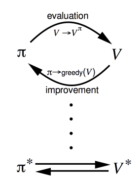

# 【David Sliver强化学习公开课之三】Dynamic Programming-学习笔记

首先列一下比较重要的Bellman方程

| Bellman方程                   | 形式                                       |
| --------------------------- | ---------------------------------------- |
| Bellman Exception Equation  | $v_{\pi}(s) = E_{\pi} [R_{t+1} + \gamma v_{\pi}(S_{t+1}) | S_t = s]$ |
| Bellman Exception Equation  | $q_{\pi}(s,a) = E_{\pi} [R_{t+1} + \gamma q_{\pi}(S_{t+1},A_{t+1}) | S_t = s, A_t = a]$ |
| Bellman Optimality Equation | $v_*(s) = \max_{a\in A} R_s^a + \gamma \sum_{s^,\in S}P_{ss^,}^av_*(s^,)$ |
| Bellman Optimality Equation | $q_*(s,a) = R_s^a + \gamma \sum_{s^,\in S}P_{ss^,}^a \max _{a^,}q_*(s^,,a^,)$ |

## 1. Introduction

动态规划是将大问题分解成小问题，把小问题解决，然后将小问题的答案进行规整，从而解决大问题。动态规划应用在强化学习中，包括策略评估和策略改进两个方面。另外，动态规划还可以应用在最短路径优化，维特比算法中等等。

运用动态规划的方法有以下几点要求：

1. 问题本身具有最优子结构
2. 小问题本身是重复的，并且小问题的解决结果能够被保存下来，这样才有动态规划的意义，否则就可以使用深度，广度优先遍历去解决问题

在强化学习中，用来对模型建模的马尔科夫过程就满足以上两个特征，贝尔曼方程就是动态规划中的转化方程，价值函数（包括$v(s)$ 和$q(s,a)$ ）都可以被保存。因此本章重点讲述在强化学习中如何利用激光动态规划的思想去解决问题。

在强化学习中使用动态规划的时候，我们是假设知道当前MDP中的所有信息，这种情况叫做”有模型的学习“。其实个人理解这样就不叫做学习了，因为整个环境中的信息已经给你了，需要做的只是”planning“。在这个过程中，我们仍然需要解决两个问题：prediction和control。prediction指的是对价值函数进行评估的过程，control指的是根据价值函数来优化 策略的过程。解决这两个的问题的途径有两种：策略迭代和值函数迭代。

## 2. 策略迭代——policy iteration

prediction

策略评估的过程指的是给定一个策略，去计算其价值函数。在上一节我们提到过，数据量比较小的情况下，可以直接计算逆矩阵。但是在数据量比较大的情况下，一般采取迭代的方式：

以贝尔曼期望方程作为迭代方程，具体如下：
$$
v_{k+1}(s) = \sum_{a\in A}\pi(a|s)(R_s^a + \gamma \sum_{s^,\in S}P_{ss^,}^a v_k(s^,))
$$
以矩阵形式表示的话：
$$
v^{k+1} = R^{\pi} + \gamma P^{\pi}v^k
$$
control

这个步骤中就是基于当前的值函数，然后采用贪心算法来找到最优的policy。

整体来看的话，策略迭代的过程如下：

## 3. 值函数迭代——value iteration

值函数迭代的主要思想就是：将一个最优化问题分成两个部分，当前采取的最佳行动，以及从下一个状态开始的最佳策略。这个思想就是最短路径的想法，如果想要找到全局的最佳路径，那么就是当前的最佳一步加上从下一步开始的最佳路径。

以比较数学的话来说，就是：最佳策略$\pi(a|s)$ 必须满足这样的特性：对任何当前状态$s$ 可达的状态$s^,$ ，$v_{\pi} (s^,)$ 都是最优值。按照这个思想，我们可以得到值函数迭代的迭代公式：
$$
v_*(s) = \max_{a\in A} R_s^a + \gamma \sum_{s^,\in S}P_{ss^,}^av_*(s^,)
$$

## 4. 两种算法的比较

| 解决问题       | 使用的贝尔曼方程          | 算法    |
| ---------- | ----------------- | ----- |
| Prediction | 贝尔曼期望方程           | 策略评估  |
| Control    | 贝尔曼期望方程 + 贪婪的策略优化 | 策略迭代  |
| Control    | 贝尔曼优化方程           | 值函数迭代 |

## 5. 异步动态规划

ps：这一部分转载自：https://zhuanlan.zhihu.com/p/28084955

以上描述的动态规划的实现都是同步的方式，就是说在一次迭代中，我们需要更新完毕所有状态才能够开始下一次迭代。为了实现异步迭代，有三种方法：In-place dynamic programming，Prioritized sweeping，Real-time dynamic programming。

In-place dynamic programming:直接原地更新下一个状态的v值，而不像同步迭代那样需要额外存储新的v值。在这种情况下，按何种次序更新状态价值有时候会比较有意义。

Prioritized sweeping:对那些重要的状态优先更新。

Real-time dynamic programming:更新那些仅与个体关系密切的状态，同时使用个体的经验来知道更新状态的选择。有些状态虽然理论上存在，但在现实中几乎不会出现。利用已有现实经验。

**本讲的内容主要还是在于理解强化学习的基本概念，各种Bellman方程，在实际应用中，很少使用动态规划来解决大规模强化学习问题。**

