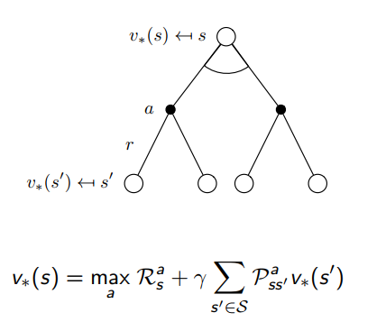

# 【David Sliver强化学习公开课之二】Markov Decision Processes-学习笔记

这节课主要通过三个过程：MP，MRP，MDP,进而导出在强化学习中比较重要的三个贝尔曼方程。

## 1. Markov Processes 

### 概念

**Markov process**：一个具有马尔科夫特性的状态序列。（马尔科夫特性：当前状态只与上一个状态相关）

**S**：状态  **P**：转移概率矩阵

### 示意图

## 2. Markov Reward Processes

### 概念

#### 1.MRD及其定义

MRD：在MC的基础上增加了奖励R和衰减因子$ \gamma $  {S,P,R,$\gamma$}

S: 有限状态集

P: 状态转移矩阵 $P_{s s^,} = P[S_{t+1} = s^, | S_t = s] $

R: 与状态相关的奖励函数 $R_s = E[R_{t+1} | S_t = s]$

$\gamma$: 衰减因子 $\gamma \in [0,1] $

#### 2.收获Return

这个定义为从t时刻开始往后的所有奖励的总和（衰减过后的）
$$
G_t = R_{t+1} + \gamma R_{t+2} + ... = \sum_{k=0}^{\infty} \gamma ^k R{t+k+1}
$$

#### 3.价值函数 value function

一个Markov Reward Process过程中某一个状态的价值函数：从当前状态开始的Markov chain收获的期望：
$$
v(s) = E[G_t|S_t = s]
$$

### 示意图

### 贝尔曼方程

#### 1. 推导

根据此图：

我们可以有这样的推断：
$$
v(s) = R_s + \gamma \sum_{s^, \in S} P_{ss^,} v(s^,)
$$
其实根据          $v(s) = E[ R_{t+1} + \gamma v(S_{t+1})|S_t = s]$     证明而来

#### 2. 求解 

对于状态集比较少的模型而言，我们可以根据公式得到解析解：
$$
v = (I - \gamma P)^{-1} R
$$
然而对于求逆这样的运算来讲，时间复杂度为$o(n^3)$，不适应大数据量的时候。因此，会用迭代的方式进行求解：动态规划方法，蒙特卡洛评估，时间差分学习等等。（后面的章节会讲）

## 3. Markov Decision Processes

### 概念

#### 1. MDP相关概念

相较于MDP，MRP增加了行动A的概念。$<S,A,P,R,\gamma>$  因为增加了行动A的概念，所以过程中的P和R都是与行为A 对应的。

P: 状态转移矩阵 $P_{s s^,}^a = P[S_{t+1} = s^, | S_t = s, A_t = a] $

R: 与状态相关的奖励函数 $R_s^a = E[R_{t+1} | S_t = s, A_t = a]$

这样P，R就相当于是一个三维的矩阵。

#### 2. 策略 policy

策略$\pi$是概率的集合或者分布，其元素$\pi(a|s)$ 为过程中某一状态$s$下可能采取的行为$a$的概率。

有了策略的定义以后，我们可以认为一个马尔科夫过程是基于某个策略的，可以这样表示$<S,P^{\pi}>$

同时有一个MRP过程$<S,P^{\pi},R^{\pi},\gamma>$， 其中有
$$
P_{s,s^,}^{\pi} = \sum _{a \in A} \pi(a|s) P_{s,s^,}^{a}
$$

$$
R_s^{\pi} = \sum _{a \in A} \pi(a|s) R_s^{a}
$$

#### 3. 价值函数 value function

state-value function：此处的$v(s)$的定义与MRP中的是一样的

action-value function：执行策略$\pi$时，对当前状态s执行某一具体行为a时所能得到的收获的期望
$$
q_{\pi}(s,a) = E[G_t|S_t = s], A_t = a]
$$

### 示意图

### 贝尔曼方程

#### 1.贝尔曼期望方程

首先，我们可以将上述两个价值函数分解成小问题进行表示，则有
$$
v_{\pi}(s) = E_{\pi} [R_{t+1} + \gamma v_{\pi}(S_{t+1}) | S_t = s]
$$

$$
q_{\pi}(s,a) = E_{\pi} [R_{t+1} + \gamma q_{\pi}(S_{t+1},A_{t+1}) | S_t = s, A_t = a]
$$

我们还可以描述$v_{\pi}(s)$ 与 $q_{\pi}(s,a)$之间的关系：

根据上图，有         $v_{\pi}(s) = \sum_{a\in A} \pi(a|s)q_{\pi}(s,a)$

根据上图，有 $q_{\pi}(s,a) = R_s^a +  \sum_{s^,\in S} P_{ss^,}^a v_{\pi}(s^,)$

将两者的关系式进行带入，有以下两个结果：

#### 2.贝尔曼优化方程

optimal value function：这里的optimal针对的对象是策略$\pi$。 

## 