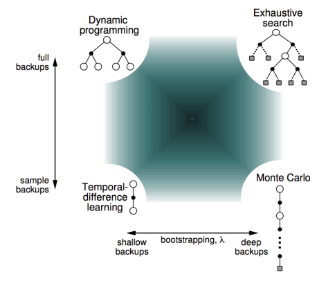
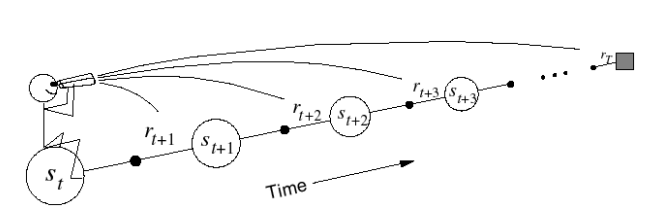
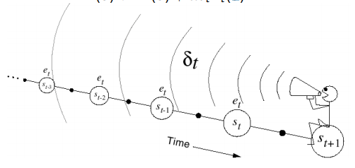
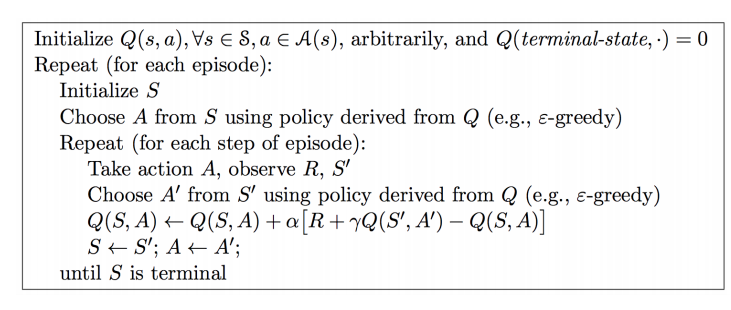
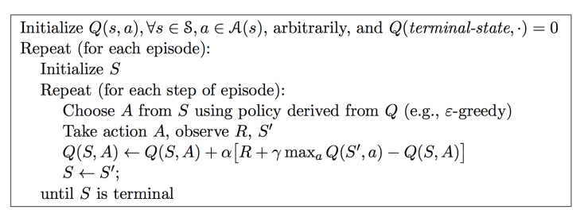

# 【David Sliver强化学习公开课之四、五】Model-Free prediction and Control-学习笔记

本次笔记来记录两次课程学习的内容，这两次课讲解的都是强化学习中无模型的问题，第三节课中描述的是强化学习中有模型的情况下的planning如何用动态规划的思想去解决。我理解的是在现实生活中，大多数的时候我们碰到的都是无模型的情况。公开课中的第四、五讲分别就无模型情况下的prediction（策略评估），control（策略迭代）问题进行了总结。

## 1. 无模型下的策略评估

### 1.1 Monte-Carlo Learning

首先我们定义一个叫做episode的概念，在强化学习中，将从某个起始状态开始执行到终止状态的一次遍历$S_1, A_1, S_2, ... , S_k$ 称为episode。蒙特卡洛的思想就是通过无穷多次的尝试，认为每个状态的值函数是在无穷多次的尝试下得到的平均值。每次尝试都必须是一个episode，即从初始状态执行到终止状态。而平均的方式又可以分为两种：every-episode 和 every-visit。

在蒙特卡洛方法中，我们需要在每一个episode之后对值函数进行更新，因此有以下方程：
$$
N(S_t) = N(S_t) + 1
$$

$$
V(S_t) = V(S_t) + \frac{1}{N(S_t)} (G_t - V(S_t))
$$

其中$G_t$ 指的是当前状态的奖励reward

### 1.2 Temporal-Difference Learning

在时间差分法中，我们不想蒙特卡洛方法一样，需要等到一个episode结束才能够更新值函数，而是采用了bootstrapping的思想，利用本次状态的后继状态更新本次状态，根据后继状态的选择可以有$TD(0)$, $TD(n)$，$TD(\lambda)$ 。其中，最简单的算法就是$TD(0)$ ，其更新公式如下所示：
$$
V(S_t) = V(S_t) + \alpha(R_{t+1} +  \gamma V(S_{t+1}) - V(S_t))
$$
此公式的表达方式与蒙特卡洛的很相似，就是用$R_{t+1} +  \gamma V(S_{t+1})$ 来代替$G_t$ 。这里，定义了一个TD error的概念，指的是值函数更新之后和更新之前的差值，公式为$\delta_t = R_{t+1} +  \gamma V(S_{t+1}) - V(S_t)$ .

$TD(n)$ 算法指的是不使用更新一步之后的状态来评估当前状态，而是使用更新n步之后的状态，当使用更新完整个episode之后的状态更新当前状态的话，就是蒙特卡洛算法了。这样，我们可以有以下更新公式：
$$
G_t^{(n)} = R_{t+1} + \gamma R_{t+2} + ... + \gamma ^{n-1} R_{t+n} + \gamma ^nV(S_{t+n})
$$

$$
V(S_t) = V(S_t) +\alpha (G_t ^{(n)}- V(S_t))
$$

$TD(\lambda)$ 算法指的是将不同的n对应的return加权平均一下：
$$
G_t^{\lambda} = (1 - \lambda) \sum _{n=1} ^{\infty} \lambda ^{n-1} G_t^n
$$

### 1.3 蒙特卡洛与时间差分法的比较

两种 算法相比，主要有以下不同：

1. TD算法可以在episode结束之前就学习到东西，蒙特卡洛必须在整个episode结束之后次啊会更新值函数

2. TD算法可以在没有最终状态的场景下进行学习

3. 蒙特卡洛算法对于值函数的估计是低偏差，高方差的；TD算法的估计是高偏差，低方差的

4. 时间差分方法可以学习到模型的马尔科夫特性，而蒙塔卡洛不行。

5. 两者采取的方法不同，TD：bootstrapping；MC：sampling。

6. 在使用有限的episode时，即batch MC 和batch TD，两者的区别在于MC方法得到的是最小化平方错误的解，而TD方法得到的是最大似然估计解。

   

### 1.4 前向$TD(\lambda)$与后向$TD(\lambda)$

上述两幅图描述了前向$TD(\lambda)$与后向$TD(\lambda)$，具体来说就是前向$TD(\lambda)$提供理论基础，然后我们使用后向$TD(\lambda)$来解决问题，以实现线上学习。在后向$TD(\lambda)$的计算过程中，需要为每个状态$S$ 保存一个变量$E(s)$ ,这个变量保存的是衰减因子，每次遇到一个新的状态时，首先计算出TD error，然后利用TD error和衰减因子一起更新至今的所有状态。
$$
\delta _t = R_{t+1} + \gamma V(S_{t+1}) - V(S_t)
$$

$$
V(s) = V(s) + \alpha \delta _t E_t(s)
$$

$$
E_t(s) = \gamma \lambda E_{t-1}(s) + 1
$$

当$\lambda = 0​$ 时，$E_t(s) =  1​$ ，

## 2. 无模型下的策略迭代

这一节主要是在第四章介绍了Model-free的对策略的评估的基础上，来介绍在model-free的情况下如何对策略进行改进，将这种策略的改进分为两种方法：on-policy learning 以及 off-policy learning.这两种学习的主演区别在于是否对eposide的当前策略进行修正，在线学习会对当前策略进行修正，而线下学习不会对当前策略进行修正。

通常的策略迭代分为两个部分策略评估，策略提升，在这两个部分中，分别可以选择不同的方法，例如在策略评估中，可以选择使用蒙特卡洛方法，时间差分法，而在策略提升中，可以选择使用贪婪法，或者$\xi$ -贪婪法等。在策略评估中，评估的目标可以是状态函数，也可以是行为，状态函数，在model-free的情况下，一般使用价值行为函数（因为价值函数需要考虑状态转移概率，在无模型的情况下比较困难）。

其实个人理解就是，整个策略迭代的过程就是对行为，价值函数进行评估的过程，而这个评估的过程是不断迭代的，这就要求我们在恰当的时候采用不同的方法进行迭代，恰当的时候可以使每个episode完成后进行迭代（例如蒙特卡洛算法），也可以在每个时间戳都进行迭代（时间差分的方法）；而恰当的方法中，我们可以选择在线学习的方法，这种方法的思想是Bellman期望方程的思想（Sarsa算法），也可以使用线下学习的方法，每次根据之前的学习结果进行这一次的迭代（Q-Learning的方法，参考了Bellman优化方程的思想）；而不同的方法都需要在更新行为，状态价值函数的时候向前看几步，选择向前看的步骤的方法也有不同（例如纯粹的贪婪法，或者是$\xi$ -贪婪法等）。

这样在么无模型的情况下，最经典的两种算法(SARSA , Q-learning)如下：

