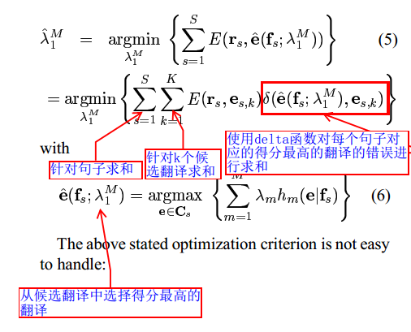

# MERT-阅读笔记

这篇文章讲的是在NLP的翻译任务中，我们应该使用什么算法来调整模型中的参数。通常情况下，机器翻译的训练准则都是最大似然，然而使用这样的准则与对未知数据的预测之间的关系并不是非常紧密。所以需要使用别的训练准则来优化模型。

在之前的研究中，我们使用最大似然准则对模型进行评估，采取梯度下降的方式对模型参数进行更新，这样的方式是能够的到比较好的效果，但是好的效果一定对应好的翻译质量吗？能保证这样的模型在未来的翻译任务中表现的比较好吗？这里是有问题存在的。

## 1. 机器翻译中的log-linear模型

在机器翻译这样的任务中，如果给几个候选的句子，我们会比较这几个句子的可能性，然后选择最高可能出现的那个，基本思想就是以最大化似然概率为目标然后更新参数。这样设计的目标函数容易找到全局最优解，然而这个目标与机器翻译质量的评估没有很明显的关系。因此，这篇文章通过调查可选择的训练目标，然后设计出可行的迭代算法。
$$
\lambda_1^M = argmax_{\lambda_1^M} {\sum_{s=1}^S log p_{\lambda_1^M}(e_s|f_s)}
$$

## 2. 翻译质量的评估手段

作者列举出了一系列的评估手段

mWER：通过比较当前翻译与参照翻译之间的最低替换次数，删除次数，插入次数等。

mPER：与上一个指标相比，不考虑位置的因素。

BLEU分数：以n-gram为语言模型，然后计算当前翻译和参照翻译之间的几何精确度。

NIST分数：跟上述很相似，不过使用的是加权精度。

## 3. 以最小化翻译错误率为目标的训练准则

在这一节，作者明确提出了如何评估翻译错误率，并且指出应该以该准则为目标进行训练.基本思路就是首先从每个句子的N的候选翻译句子中选择得分最高的翻译，然后对比该干邑结果与参考结果之间的差异，以最小化这样的目标来寻找参数。

## 4. 优化算法[参考链接](http://blog.csdn.net/ict2014/article/details/25307019)

最优化算法是基于Powells算法：优化参数是一个k维向量时，可以只改变其中一个参数，固定其他参数，更新目标函数的值。但是这个方法中，我们必须时刻权衡步长和效率之间的问题，可能会找不到最优值。因此在这样的思想基础上，大佬提出了一个非常非常厉害的idea，用直线来寻找最优解。

首先，我们对d为向量中的一个维度进行更新，变量为$\lambda _d$, 这样每个源句子对应的N的候选句子的得分值就会发生变化，得分值是$\lambda _d$,的变量，因此根据一个句子我们得到N条变化的直线（横坐标为$\lambda _d$, 纵坐标为得分），然后描绘这N条直线的上限，我们会得到当前句子根据第d个维度的变化而产生的的份上的变化。然后按照这样的思想，我们描绘出所有句子关于$\lambda _d$,的变化折线图。然后通过总结所有折线图的拐点，并且将当前区间所有句子的变化进行求和，然后计算变化率，我们能够得到一个以$\lambda _d$ 为横轴，以score变化率为纵轴的区间直线图，然后选择变化最大的那个区间的$\lambda _d$ 就可以。

