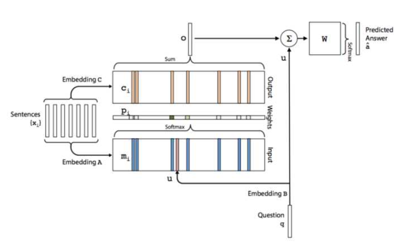

# 斯坦福李纪博士毕业论文：让机器像人一样交流——阅读笔记

ps：仰慕大神

## 摘要

随着神经网络模型的出现，早期系统无法处理的很多问题变得可以解决了：端到端神经网络提供了可扩展和语言独立的框架，在语义理解上为自动回复的产生提供了可能性。

与此同时，神经网络模型也带来了很多新的挑战：

1. 比如它们倾向于无趣泛泛的回答，如：「我不知道你在说什么。」；
2. 再有，它们经常缺乏像人类一样的人格特性，导致产生的回复经常是不一致的；
3. 他们大多数情况仅仅是被动地回答问题，而没有能力去主导对话。

因此，这个文章从两个方面出发，去解决一些问题：

1. open-domain dialogue generation systems 解决开发域对话生成系统中的问题：

   a. 使用互信息来衡量句子，以助于不会生成类似“我不知道你在干什么”这样的句子。

   b. 强调用户的一致性

   c. 使用强化学习方法使得长期对话的成功率增加

   d. 使用对抗学习的方法是使机器产生回复的结果与人类对话的结果相似性提高

2. 解决交互式对话系统中的问题：

   a. 让机器有提出问题的能力

   b.提出交互式模型

## 第一章：介绍

### 1.1 三种对话系统的简要介绍

#### 1.1.1 the chit-chat system 开放领域聊天系统

##### The rule-based systems:

系统根据输入的单词查找关键词，如果找到该关键词，则根据预定义的规则进行输出，否则则随意输出。

##### The IR-based systems：

该方法依赖于信息检索或者最近邻技术：通过计算语料库中句子与提问句子的相似性，从而

##### The generation-based systems

#### 1.1.2 the frame-based goal oriented system 目标导向的框架系统

#### 1.1.3 the interactive question-answering dialogue system 问答交互对话系统

## 第二章：背景

### 2.1 序列到序列生成

#### 2.1.1 语言模型

语言模型的定义就是通过给定的前置语句，来预测句子下一个单词的任务。

#### 2.1.2 循环神经网络RNN

#### 2.1.3 LSTM

#### 2.1.4 序列-序列生成

#### 2.1.5 注意力 Attention 机制

### 2.2 记忆网络： [参考链接](https://zhuanlan.zhihu.com/p/29679742)

记忆网络可以说是针对于自然语言处理进行特别设计的，尽管在之前的LSTM，以及Attention机制中，都有关于之前记忆的数据流，但是保存的时间并不长，所以为了能够让当前词语知道很久之前的信息，出现了专门设计的记忆网络。

一般的记忆网络中包括输入层，记忆层，输出层和回应层。入层负责将语句通过词嵌入，BOW或者位置编码转化为词向量，然后将其保存在memory中（其实个人对memory的理解就是一个矩阵，里面是各个语句对应的词向量）；输出模块负责将输入的问题与记忆层中的各个语句进行匹配，选择出关联最大的k个记忆源；最后由回应层根据输入和选出来的k个记忆源一同作用，输出对当前问题的回答。在End-To-End的记忆网络中，参数主要包括A,B,C,W四个矩阵，其中A,B,C三个矩阵就是embedding矩阵，主要是将输入文本和Question编码成词向量，W是最终的输出矩阵。从下图可以看出，对于输入的句子s分别会使用A和C进行编码得到Input和Output的记忆模块，Input用来跟Question编码得到的向量相乘得到每句话跟q的相关性，Output则与该相关性进行加权求和得到输出向量。然后再加上q并传入最终的输出层。这个图片中的是记忆网络的单层表示，还可以有多层模型。

### 2.3 策略梯度办法

策略梯度方法是强化学习中用来对参数化策略进行学习的方法，此方法不同于Q-学习方法的地方在于没有对价值函数进行参数化，而是直接对策略进行参数化学习。

## 第三章：用交互信息避免泛化回复

在之前的研究中，我们使用最大似然估计来作为训练目标，这样导致我们得到的回复大多是无意义的“我不知道”，因此，为了让回复变的更加有针对性，作者设计了另一种训练目标：最小交叉熵。

### 3.1 模型设计

#### 3.1.1 MIMI模型的设计

如果是基于最大似然函数估计的话，目标函数是这个样子的：
$$
y = argmax_y\{log (p(y|x))\}
$$
作者将其改为
$$
log\frac {p(x,y)} {p(x)p(y)}
$$
然后，作者根据此公式，将训练目标做了两种变形：
$$
MMI-antiLM:                 y = argmax_y\{log (p(y|x)) - \lambda log(p(y))\}
$$

$$
MMI-bidi: y = argmax_y\{(1-\lambda)log (p(y|x)) + \lambda log(p(x|y))\}
$$

同时作者提出，这个目标函数并没有拿来做训练，只是在testing（也就是infrence阶段）的时候用，平时训练还是使用最大似然估计。

#### 3.1.2 将此模型应用于实践的几点考虑

##### MMI-antiLM准则

在使用MMI-antiLM准则对候选句子进行筛选排序是，实践证明其倾向于选择语法有错误的句子，尽管在理论上，语法错误的句子因为准则中的前一项比较小而不会被选择，但是实践仍然显示有这样的倾向。

为了解决这个困难，作者将

##### MMI-bidi准则

在对k个不完整的候选项进行选择时，我们需要在K个候选项上继续生成$K^2$ 个候选项，即每个候选项要有K个后继候选，然后再次这$K^2$ 个候选项中选择其中表现比较好的K个，而实践表明，最后生成的k个候选项一般相似性非常大，因此为了能够增加候选项的多样性，在对后继项进行选择时，我们在打分的时候不仅考虑其根据MMI0-bibi准则得到的分数，要需要考虑其在上一个候选项中的排名，这样就能够总是选择相似的候选项，示意图如下：

#### 3.1.3 训练

#### 3.1.4 解码阶段

使用两种准则进行解码。

### 3.2 试验阶段

在这一章，作者指出使用了两个数据源：Twitter和OpenSubtitles 来进行试验的验证，同时使用了BLEU和人工打分两种方法对模型进行评估。

## 第四章：解决说话者一致性问题

### 4.1 模型设计

#### 4.1.1 Speaker Model

我理解的是在训练模型中加入一个向量来表示说话人的特征（包括性别，年龄，居住地等等），个人理解，这个向量的个数是训练样本中所有说话对象的个数，然后训练拥有同样说话对象的句子时使用同样的speaker向量。

#### 4.1.2 Speaker Addressee Model

这个模型的提出是针对于一个人对不同的人说话可能会有不同的反应，因此设计了向量$V_{i,j}$ 来表示。

## 第五章：让对话更持久

第六章：通过对抗学习生成对话

第七章： 给机器人提问的能力

第八章：利用人机回圈的对话学习

